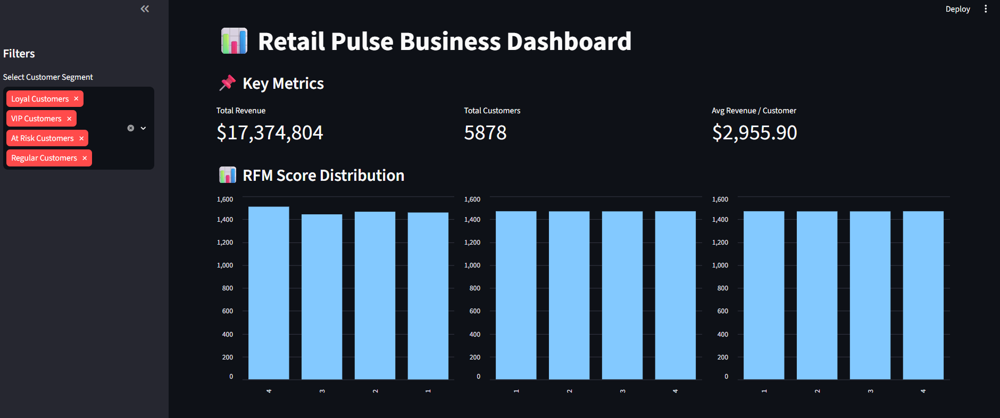
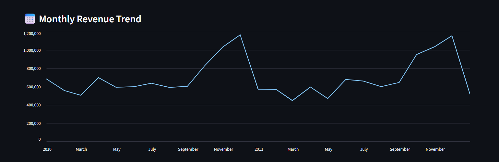
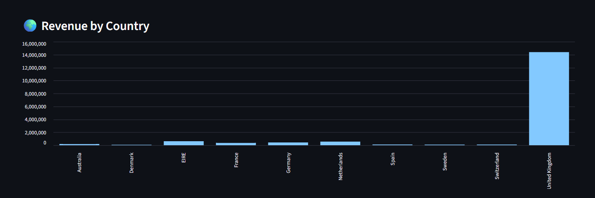
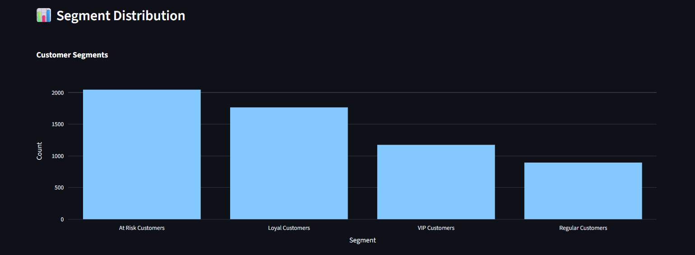
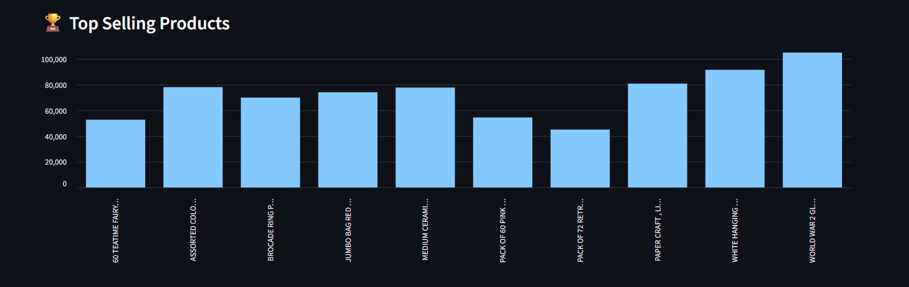
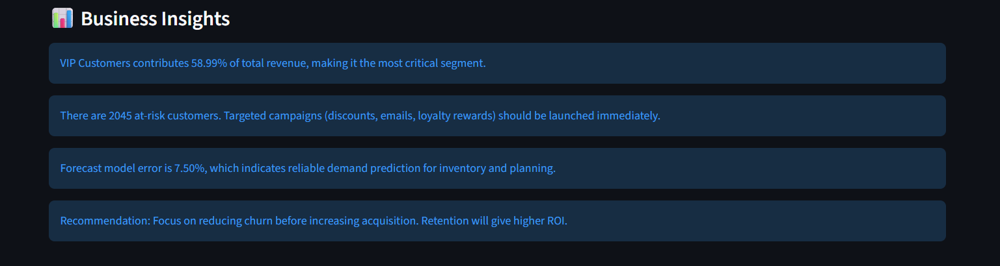

# RetailPulse: Customer Analytics & Forecasting Dashboard

RetailPulse is an end-to-end data analytics project that transforms raw retail transaction data into actionable business insights using customer segmentation, demand forecasting, and an interactive Streamlit dashboard.

---

## Problem Statement

Retail businesses often struggle to:

- Identify high-value customers
- Predict future sales demand
- Reduce customer churn
- Make data-driven business decisions

RetailPulse addresses these challenges using machine learning, forecasting, and business analytics.

---

## Features

- 📊 Data Cleaning & Preprocessing
- 👥 Customer Segmentation (RFM Analysis)
- 🤖 Customer Clustering (K-Means)
- 🔮 Sales Forecasting (Prophet)
- 📈 Interactive Streamlit Dashboard
- 🌍 Revenue Analysis by Country
- 🏆 Top Selling Products Analysis
- 💡 Automated Business Insights

---

## 📊 Dashboard Preview

### Main Dashboard



### Monthly Revenue Trend



### Revenue by Country



### Segment Distribution



### Top Selling Products



### Business Insights



---

## Key Insights

- VIP customers contribute nearly 59% of total revenue.
- More than 2,000 customers are at risk of churn.
- Sales forecasting achieves approximately 7% MAPE.
- Revenue is highly concentrated among a small customer segment.

---

## Tech Stack

- Python
- Pandas
- NumPy
- Scikit-learn
- Prophet
- Streamlit
- Plotly
- Matplotlib
- OpenPyXL

---

## 📁 Project Structure

```
RetailPulse/
│
├── app/
│   └── streamlit_app.py
│
├── notebooks/
│   └── eda.ipynb
│
├── screenshots/
│   ├── Dashboard.png
│   ├── Business Insights.png
│   ├── Monthly Revenue Trend.png
│   ├── Revenue by Country.png
│   ├── Segment Distribution.png
│   └── Top Selling Products.png
│
├── src/
│   ├── analysis/
│   ├── data/
│   ├── features/
│   ├── insights/
│   ├── models/
│   ├── utils/
│   └── pipeline.py
│
├── requirements.txt
├── .gitignore
└── README.md
```

---

##  Installation

```bash
git clone https://github.com/PunitaS/RetailPulse.git

cd RetailPulse

pip install -r requirements.txt
```

---

##  Run the Dashboard

```bash
python -m streamlit run app/streamlit_app.py
```

---

## 🚀 Future Improvements

- Deep Learning Forecasting (LSTM)
- Real-time Sales Prediction
- Inventory Optimization
- Customer Lifetime Value Prediction
- Cloud Deployment
- REST API Integration

---

## 👩‍💻 Author

**Punita Singh**

GitHub: https://github.com/PunitaS